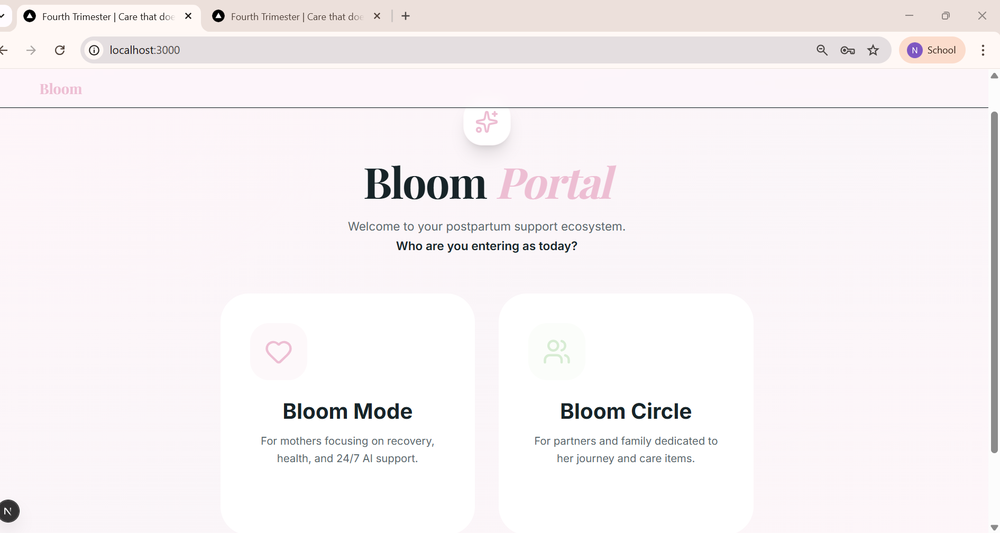
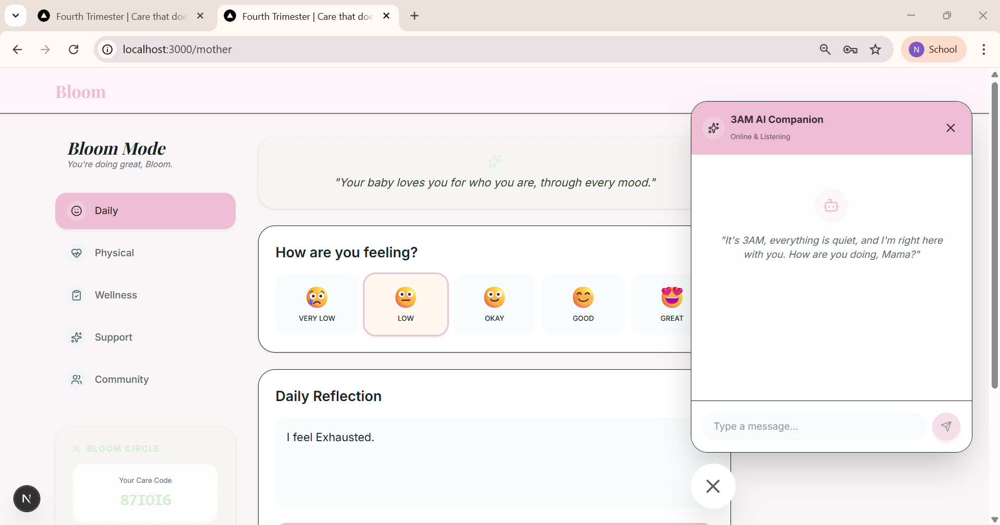
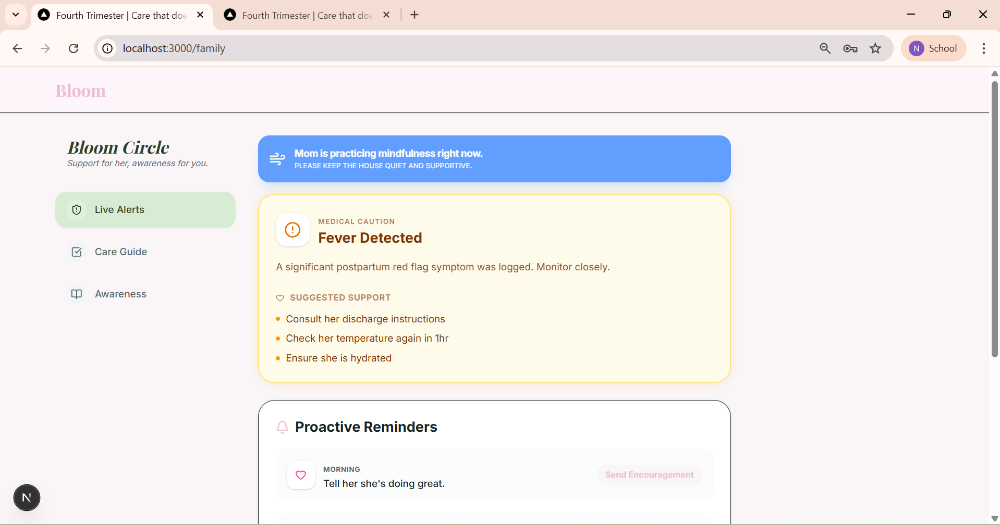
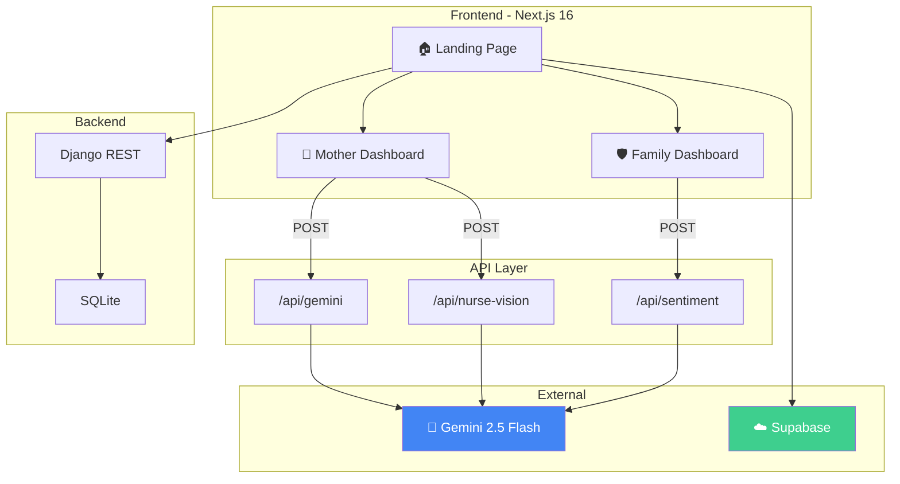

# 🌸 Bloom: The Fourth Trimester Postpartum Care Platform

[](LICENSE)
[](https://nextjs.org/)
[](https://djangoproject.com/)
[](https://ai.google.dev/)

> **No mother should feel alone in the Fourth Trimester.**

Bloom is an AI-first postpartum care platform that bridges the gap between hospital discharge and full recovery. By combining empathetic AI companions, clinical-grade visual analysis, and logic-driven family alerts, Bloom transforms the isolating experience of early motherhood into a connected, supported journey.

---

## 🚀 Features

| # | Feature | Description |
|---|---|---|
| 1 | **🤱 Daily Check-In** | Personalized dashboard for mood, pain, and energy tracking with affirmations |
| 2 | **📷 Nurse AI Vision** | Snap a photo → get instant AI-powered analysis of fatigue, hydration, and emotional state |
| 3 | **💬 3AM AI Companion** | A gentle, empathetic chatbot available during the hardest hours of the night |
| 4 | **🚨 Smart Alerts** | Logic-driven alerts that flag "Silent SOS" signals and mood dips to family members |
| 5 | **💗 Sentiment Pulse** | Background AI analysis of mood history to keep family members informed |
| 6 | **📋 Proactive Reminders** | Family can send targeted encouragement and support notifications to the mother |
| 7 | **🧘 Guided Breathing** | Built-in breathing exercises for stress relief and mindfulness |
| 8 | **🔒 Privacy-First** | All sensitive data stays client-side; images are never stored on disk |

---

## 🛠️ Tech Stack

| Layer | Technology | Version |
|---|---|---|
| **Frontend** | Next.js (React) + TypeScript | 16.1.6 |
| **Styling** | Tailwind CSS + Framer Motion | 4.x |
| **Backend** | Django REST Framework | 6.0.2 |
| **AI Engine** | Google Gemini 2.5 Flash | via `@google/genai` SDK |
| **Database** | SQLite (dev) | 3.x |
| **Cloud** | Supabase (Auth + Storage) | — |
| **Package Manager** | npm | 10.x |

---

## 📸 Screenshots

| Landing Page | Mother's Dashboard | Family Dashboard |
|---|---|---|
|  |  |  |

---

## 🎬 Demo Video

🔗 **[Watch Demo Video →](https://youtu.be/KWoIjRlCsPo)**

---

## 🏗️ Architecture



📄 **[Full Architecture Diagram →](docs/architecture.md)**

---

## 📡 API Documentation

| Endpoint | Method | Description |
|---|---|---|
| `/api/gemini` | POST | 3AM AI Chat — multi-turn conversation |
| `/api/nurse-vision` | POST | Nurse AI — multimodal facial analysis |
| `/api/sentiment` | POST | Sentiment Pulse — mood trend analysis |

📄 **[Full API Docs →](docs/api-docs.md)** | 🤖 **[AI Prompts & Tools →](docs/ai-prompts.md)**

---

## ⚙️ Installation & Setup

### Prerequisites
- Node.js 18+
- Python 3.10+
- A [Google AI Studio](https://aistudio.google.com/) API key

### 1. Clone the repository
```bash
git clone https://github.com/nehabenny/fourth-trimester-postpartum.git
cd fourth-trimester-postpartum
```

### 2. Install Frontend Dependencies
```bash
npm install
```

### 3. Install Backend Dependencies
```bash
cd backend
pip install -r requirements.txt
python manage.py migrate
cd ..
```

### 4. Setup Environment Variables
Create a `.env.local` file in the root:
```env
GEMINI_API_KEY=your_gemini_api_key_here
NEXT_PUBLIC_SUPABASE_URL=your_supabase_url
NEXT_PUBLIC_SUPABASE_ANON_KEY=your_supabase_anon_key
```

### 5. Run the Application
```bash
# Terminal 1 — Frontend
npm run dev

# Terminal 2 — Backend
cd backend
python manage.py runserver 8000
```

Open [http://localhost:3000](http://localhost:3000) in your browser.

---

## 📂 Project Structure

```
fourth-trimester-postpartum/
├── app/                    # Next.js pages & API routes
│   ├── api/
│   │   ├── gemini/         # 3AM Chat endpoint
│   │   ├── nurse-vision/   # Vision analysis endpoint
│   │   └── sentiment/      # Sentiment analysis endpoint
│   ├── mother/             # Mother's dashboard page
│   ├── family/             # Family's dashboard page
│   └── page.tsx            # Landing page
├── components/
│   ├── mother/             # Mother-specific components
│   │   ├── AiChat.tsx      # 3AM AI Companion
│   │   └── CameraCapture.tsx # Nurse AI Vision
│   └── family/             # Family-specific components
│       └── SmartAlerts.tsx  # Smart Alerts engine
├── backend/                # Django REST backend
│   ├── bloom_backend/      # Django settings
│   └── users/              # User auth & profiles
├── docs/                   # Documentation
│   ├── architecture.md     # System architecture diagram
│   ├── api-docs.md         # API endpoint docs
│   └── screenshots/        # Application screenshots
├── public/                 # Static assets
├── .env.local              # Environment variables (not committed)
├── LICENSE                 # MIT License
└── README.md               # This file
```

---

## 🛣️ Roadmap

- [x] Dual-mode ecosystem (Mother + Family)
- [x] Nurse AI Vision with facial analysis
- [x] 3AM AI Companion chat
- [x] Smart Alerts with Silent SOS detection
- [x] Sentiment Pulse background analysis
- [ ] 📱 WhatsApp/SMS notification integration (Twilio)
- [ ] 🏥 Clinic Integration — Share AI logs with OB/GYN
- [ ] 📊 Predictive Analytics — 14-day PPD risk scoring
- [ ] 📍 Bloom Directory — Local support group finder

---

## 👥 Team

| Name | Role |
|---|---|
| **Neha Benny** | Frontend Development, AI Integration, UI/UX Design |
| **Sanjana M Paul** | Backend Development, API Architecture, Database Design |

---

## 🤖 AI Tools Used

| Tool | Purpose |
|---|---|
| Google Gemini 2.5 Flash | Core AI engine for chat, vision analysis, and sentiment |
| Google AI Studio | API key management and model testing |
| Gemini Code Assist | Development assistance and debugging |

---

## 📄 License

This project is licensed under the **MIT License** — see the [LICENSE](LICENSE) file for details.

---

## ⚠️ Disclaimer

*Bloom is a support tool and should never replace professional medical advice. If you or someone you know is experiencing a postpartum emergency, please contact your healthcare provider immediately.*

---

**Built with ❤️ for every mother who needs a sanctuary.**
