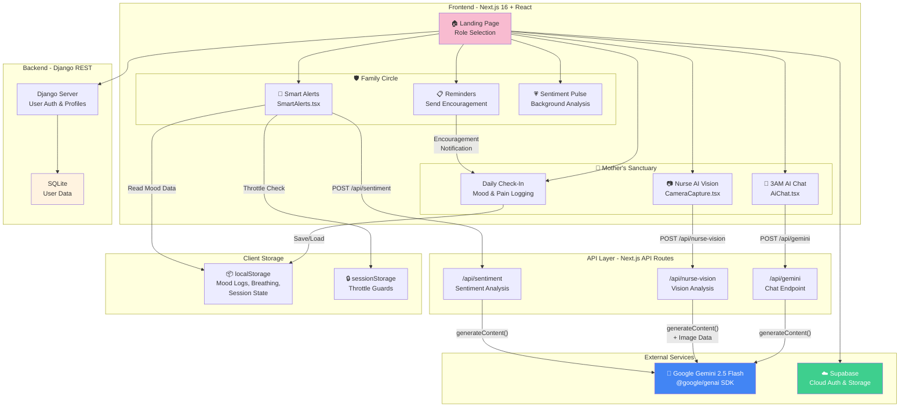

# 🏗️ Architecture Diagram

## System Overview

## Data Flow Summary

| Flow | From | To | Method |
|---|---|---|---|
| Chat Message | Mother → AiChat | `/api/gemini` → Gemini | POST |
| Face Analysis | Mother → Camera | `/api/nurse-vision` → Gemini (Vision) | POST |
| Sentiment Check | Family → SmartAlerts | `/api/sentiment` → Gemini | POST |
| Mood Sync | Mother → localStorage | Family Dashboard | Client-side read |
| Encouragement | Family → Reminders | Mother Dashboard | localStorage write |
| Auth | Both Dashboards | Django/Supabase | POST |

## Security Notes
- API keys stored server-side only (`.env.local`)
- Image data processed in-memory, never persisted
- Mood logs stored client-side in localStorage
- Session throttling prevents quota abuse
